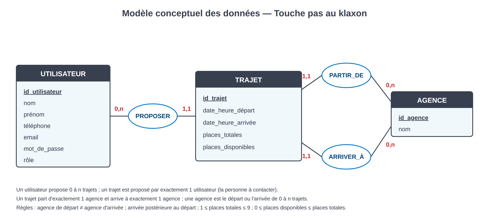
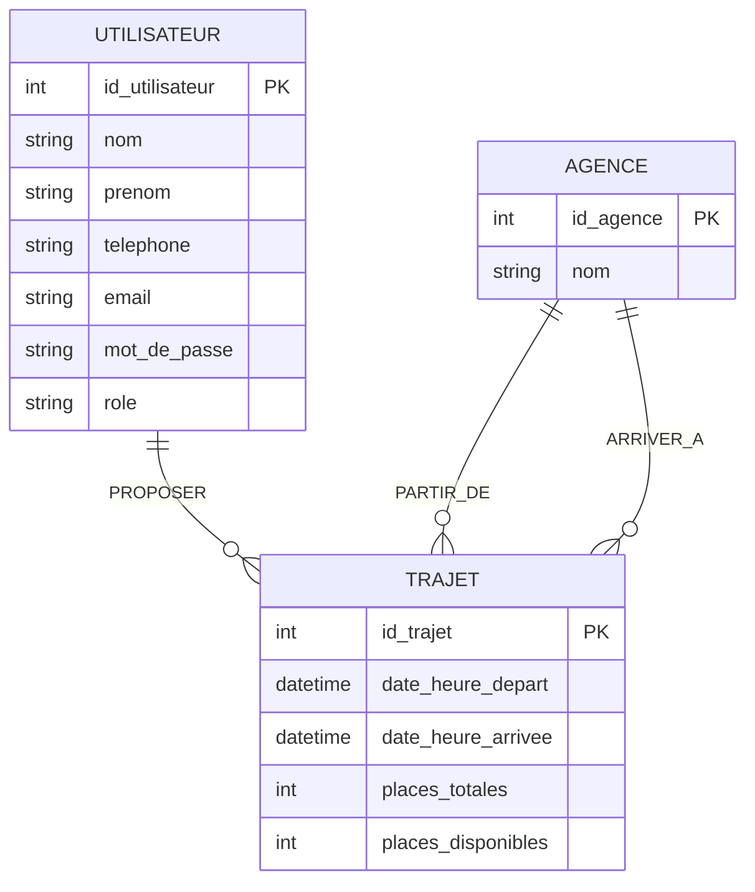

# Modèle conceptuel des données (MCD)

Formalisme Merise. Trois entités, trois associations.

## Entités

| Entité | Identifiant | Propriétés |
| --- | --- | --- |
| **AGENCE** | id_agence | nom |
| **UTILISATEUR** | id_utilisateur | nom, prénom, téléphone, email, mot_de_passe, rôle |
| **TRAJET** | id_trajet | date_heure_départ, date_heure_arrivée, places_totales, places_disponibles |

## Associations et cardinalités

| Association | Côté 1 | Côté 2 | Lecture |
| --- | --- | --- | --- |
| **PROPOSER** | UTILISATEUR (0,n) | TRAJET (1,1) | Un utilisateur propose zéro ou plusieurs trajets ; un trajet est proposé par exactement un utilisateur, qui est la personne à contacter. |
| **PARTIR_DE** | AGENCE (0,n) | TRAJET (1,1) | Une agence est le point de départ de zéro ou plusieurs trajets ; un trajet part d'exactement une agence. |
| **ARRIVER_À** | AGENCE (0,n) | TRAJET (1,1) | Une agence est la destination de zéro ou plusieurs trajets ; un trajet arrive à exactement une agence. |

## Règles de gestion

1. L'agence de départ et l'agence d'arrivée d'un trajet sont différentes.
2. La date-heure d'arrivée est strictement postérieure à la date-heure de départ.
3. Le nombre de places totales est compris entre 1 et 9.
4. Le nombre de places disponibles est compris entre 0 et le nombre de places totales.
5. Le nom d'une agence est unique ; l'adresse e-mail d'un utilisateur est unique.
6. Une agence référencée par un trajet ne peut pas être supprimée.
7. Les utilisateurs proviennent du SI RH : l'application ne les crée, ne les modifie ni ne les supprime.

## Diagramme

Source vectorielle : [`mcd.svg`](mcd.svg). Représentation équivalente en notation entité-association :

